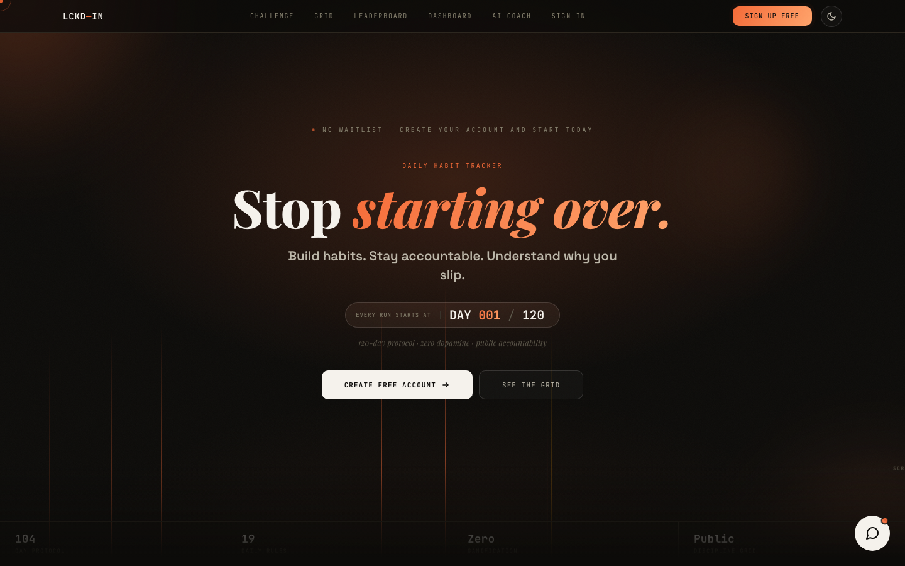

<div align="center">

# LCKD—IN

**A daily discipline tracker. Log your day in 5 seconds, and see what's actually breaking your streak.**

[**lckd-in.com**](https://www.lckd-in.com)



</div>

## What it is

LCKD—IN is a habit-accountability web app built around a fixed-length protocol (7, 30, 75, 120 days, or custom). Each day you check off your rules. Your progress lives on a public, shareable grid, and an AI coach looks at your own history to find the one habit that drags the others down.

## Features

- **Streak grid.** One square per day: perfect, partial, missed, or protected by a pivot. Click a square for the rule-by-rule breakdown.
- **Pivot Protocol.** Miss a whole day and you can spend one of five pivots to protect your streak instead of resetting it.
- **AI Coach.** A 7-day correlation pass finds your root-cause habit, then Gemini turns the numbers into specific coaching.
- **Snap & Track.** Photograph a handwritten log and Gemini vision maps the checkmarks to your rules.
- **Custom rules.** Add, edit, and remove your own rules, with `!` / `!!` / `!!!` priority tags.
- **Public profile.** Every account gets a shareable `lckd-in.com/u/<username>` grid.
- **Fair leaderboard.** Ranked by average score, so a 7-day run competes fairly with a 120-day one.
- **Daily reminder emails**, dark/light theme, and an installable PWA.

## Tech stack

| Layer | Tech |
|---|---|
| Frontend | Vanilla HTML / CSS / JS. No framework, no build step |
| Backend | [Supabase](https://supabase.com): Postgres, Auth, Row Level Security, Edge Functions (Deno) |
| AI | Google Gemini (vision + text) |
| Email | [Resend](https://resend.com) |
| Hosting | [Vercel](https://vercel.com) |
| Analytics | [PostHog](https://posthog.com): product analytics and Web Vitals |

## Project structure

```
lckdin/
├── frontend/                  # everything Vercel serves
│   ├── index.html             # landing page + sign-up / sign-in       →  /
│   ├── dashboard.html         # the app                                 →  /app
│   ├── profile.html           # public accountability grid              →  /u/:username
│   ├── analytics.js           # PostHog wrapper (never throws, prod-only)
│   ├── feedback-widget.js     # floating feedback button → feedback table
│   ├── manifest.json          # PWA manifest
│   ├── sw.js                  # service worker (network-first offline shell)
│   ├── vercel.json            # rewrites + redirects
│   └── assets/
│       ├── icons/             # favicon, app icons
│       ├── images/            # social preview, quote backgrounds
│       └── branding/          # logo source files
├── backend/
│   └── supabase/
│       ├── config.toml        # per-function settings
│       ├── functions/         # edge functions
│       │   ├── adapt-agent/          # daily agent: suggests one adapted rule
│       │   │   ├── index.ts          # handler: candidates, optional Gemini rewording, insert
│       │   │   ├── logic.ts          # pure decision + template logic (no AI)
│       │   │   └── logic.test.ts     # node backend/supabase/functions/adapt-agent/logic.test.ts
│       │   ├── analyze-journal/      # Snap & Track (Gemini vision)
│       │   ├── ai-coach/             # AI Coach (Gemini)
│       │   ├── send-daily-reminder/  # cron reminder email
│       │   └── send-waitlist-email/  # waitlist welcome email
│       └── migrations/        # database schema history
├── docs/
│   ├── adapt-agent.md         # suggested-adjustment agent + merge runbook
│   ├── analytics.md           # event taxonomy + privacy rules
│   ├── architecture.md        # how the pieces fit together
│   └── deploy.md              # deploying frontend, functions, migrations
├── .github/
│   ├── workflows/             # CI: secret-scan (gitleaks), design-check, smoke-test
│   ├── scripts/design_check.py
│   ├── design-allowlist.txt   # every color the frontend may use
│   └── gitleaks.toml          # secret rules + public-key allowlist
├── .claude/agents/            # Claude Code subagents: design-guard, deploy-check,
│                              #   repo-keeper, supabase-guard
└── CLAUDE.md                  # rules for AI-assisted changes (design system, no-touch code)
```

## Run locally

The frontend is static files that talk to the hosted Supabase project, so any static server works:

```bash
cd frontend
python3 -m http.server 8000
```

Then open `http://localhost:8000` for the landing page and `http://localhost:8000/dashboard.html` for the app. The `/app` and `/u/:username` routes are Vercel rewrites. To get those locally, run `npx vercel dev` from `frontend/`.

## Deploy

- **Frontend:** push to `main`. Vercel (Root Directory = `frontend`) deploys to production automatically.
- **Edge functions:** `cd backend && supabase functions deploy <name> --project-ref qtlhpaqsmbyneivdsiei`

Full details, including secrets and migrations, are in [`docs/deploy.md`](docs/deploy.md). For how it all fits together, see [`docs/architecture.md`](docs/architecture.md).

## Security

- Row Level Security limits every personal table to owner-only access.
- Public pages (leaderboard, profile grid, username check) go through narrow `SECURITY DEFINER` functions that return only the fields they render.
- API keys live in Supabase secrets, never in this repo.
