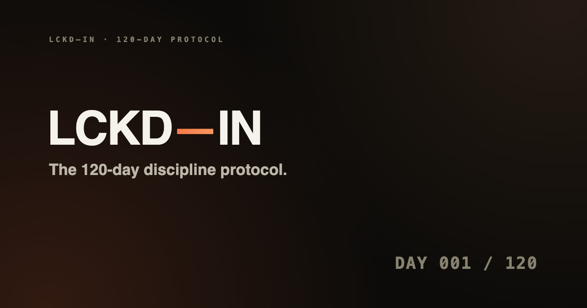

<div align="center">



# LCKD—IN

**The 120-day discipline protocol. Execute without excuses.**

[www.lckd-in.com](https://www.lckd-in.com)

</div>

---

## What it is

LCKD—IN is a daily habit-accountability app built around one idea: **log your day in 5 seconds, and let the app catch what's actually breaking your streak** — not vague motivation, real pattern analysis from your own data.

Pick a protocol length (7, 30, 75, 120 days — or anything custom), check off your rules each day, and your progress lives on a public, shareable grid. No fake stats, no filler — every number on the page is either real user data or clearly labeled as an example.

## Features

- **Streak grid** — a 120-square (or however long you choose) visual record of every day: perfect, partial, missed, or protected by a pivot. Click any square to see the full rule-by-rule breakdown for that day.
- **Pivot Protocol** — miss a day completely and you can spend one of a limited number of pivots to protect your streak instead of resetting to zero. Discipline that accounts for being human.
- **AI Coach** — real 7-day correlation analysis (not a canned tip) finds the one habit quietly dragging the rest down, backed by an LLM pass for specific, non-generic coaching.
- **Snap & Track** — photograph a handwritten log and AI vision reads the checkmarks and maps them to your rules automatically.
- **Custom rules** — add, edit, remove, and label your own rules (with quick `!` / `!!` / `!!!` priority tags) instead of a fixed list.
- **Public accountability grid** — every account gets a shareable `lckd-in.com/u/username` page. Your discipline is public by default.
- **Fair leaderboard** — ranked by average score (a normalized rate), not raw day count, so a finished 7-day run competes fairly against someone 40 days into a 120-day one.
- **Completion celebration** — finish your protocol and get a real congratulations screen with the choice to extend or start a new length.
- **Daily reminder emails**, dark/light theme, and a installable PWA shell.

## Tech stack

No framework — vanilla HTML/CSS/JS, kept deliberately simple and fast.

| Layer | Tech |
|---|---|
| Frontend | Vanilla JS, hand-written CSS (no build step) |
| Backend | [Supabase](https://supabase.com) — Postgres, Auth, RLS, Edge Functions |
| AI | Gemini (vision for Snap & Track, coaching analysis) |
| Email | [Resend](https://resend.com) |
| Hosting | [Vercel](https://vercel.com) |

## Project structure

```
index.html      — marketing site + sign-up/sign-in
dashboard.html   — the real app (served at /app)
profile.html     — public accountability grid (served at /u/:username)
manifest.json    — PWA manifest
sw.js            — service worker (offline shell, network-first)
vercel.json      — routing/rewrites
assets/          — icons, backgrounds, image assets
```

## Security

- Row Level Security locked to owner-only reads on all personal tables.
- Public pages (leaderboard, profile grid, username availability) go through narrow `SECURITY DEFINER` database functions that expose only the specific fields those pages need — never raw table access.

---

<div align="center">

Built solo, iterated daily.

</div>
